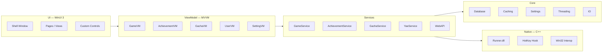

  

<h1 align="center">ky3 launcher</h1>

  
  
  
  
  
  

原神（Genshin Impact）第三方启动器，基于 WinUI 3 构建。

## 架构

## 功能

- 游戏启动与插件管理
- 包含部分 Wiki 百科
- 成就追踪
- 自动签到
- DLL 模组加载管理
- 多语言本地化支持（zh-CN）

## 技术栈

- .NET 10 / WinUI 3（Windows App SDK）
- C# 13（preview）
- MVVM Toolkit
- SQLite（本地数据库）
- WebView2

## 环境要求

| 项 | 要求 |
|---|---|
| 操作系统 | Windows 10 2004（19041）及以上 |
| 架构 | x64 |
| VC++ 运行库 | 2015–2022 x64 |
| WebView2 运行时 | 任意版本 |

## 相关仓库

| 仓库 | 说明 |
|---|---|
| [ky3-launcher-plugin-module](https://github.com/ky3-git/ky3-launcher-plugin-module) | 本项目使用的 DLL 插件模块 |
| [ky3-metadata](https://github.com/ky3-git/ky3-metadata) | 游戏元数据 JSON 集合 |
| [Yae](https://github.com/HolographicHat/Yae) | 原神成就解锁工具，实现非常出色，本项目成就追踪功能 |

## 贡献

欢迎提交 Issue 和 Pull Request。

- [**Issue**](https://github.com/ky3-git/ky3-Launcher/issues)：反馈 Bug、提出功能建议
- [**Pull Request**](https://github.com/ky3-git/ky3-Launcher/pulls)：修复问题或新增功能，请确保代码可正常编译

## 致谢

本项目基于胡桃启动器的架构设计思路衍生开发，感谢 DGP Studio 和其他贡献成员的开源工作。

## License

[MIT](LICENSE)
