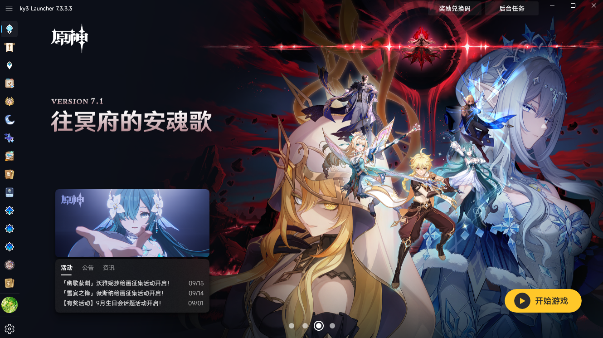

  

<h1 align="center">ky3 Launcher</h1>

  <strong>A modern third-party launcher for Genshin Impact, built with WinUI 3</strong>

  English | <a href="README.zh-CN.md">简体中文</a>

  
  
  
  
  
  
  
  
  

---

## Preview

  

